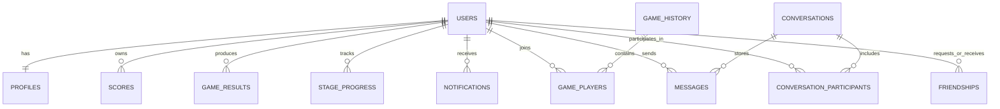

*This project has been created as part of the 42 curriculum by horandri, rorandri, tmory, llalatia, mikandri*

# Blackhole

> **[Documentation Hub]**
> - 📂 **[Feature Deep-Dives](file:///home/rorandri/Music/ft_transcendence/docs/features/)**: [Intro & Menu](file:///home/rorandri/Music/ft_transcendence/docs/features/menu_intro.md) | [Social & Activity](file:///home/rorandri/Music/ft_transcendence/docs/features/social_activity.md) | [Multiplayer](file:///home/rorandri/Music/ft_transcendence/docs/features/multiplayer.md) | [Profile & Achievements](file:///home/rorandri/Music/ft_transcendence/docs/features/profile_achievements.md)
> - 👤 **[Team Contributions](file:///home/rorandri/Music/ft_transcendence/docs/team/)**: [horandri](file:///home/rorandri/Music/ft_transcendence/docs/team/README_horandri.md) | [rorandri](file:///home/rorandri/Music/ft_transcendence/docs/team/README_rorandri.md) | [tmory](file:///home/rorandri/Music/ft_transcendence/docs/team/README_tmory.md) | [llalatia](file:///home/rorandri/Music/ft_transcendence/docs/team/README_llalatia.md) | [mikandri](file:///home/rorandri/Music/ft_transcendence/docs/team/README_mikandri.md)
> - ⚖️ **Legal Compliance**: [Privacy Policy](file:///home/rorandri/Music/ft_transcendence/frontend/src/views/PrivacyView.vue) | [Terms of Service](file:///home/rorandri/Music/ft_transcendence/frontend/src/views/TermsView.vue)

## Description

**Blackhole** is our `ft_transcendence` project: a Docker-first multiplayer maze game combined with a real-time social platform.

The project was designed to satisfy the mandatory requirements of the subject by delivering:

- a real web application with a frontend, a backend, and a relational database;
- simultaneous multi-user support;
- secure authentication and HTTPS-only backend access;
- a real-time multiplayer gameplay loop;
- a maze predator that acts as an AI opponent in solo matches;
- persistent social interactions such as public profiles, friends, chat, notifications, and progression points;
- a public API secured by API key with rate limiting and OpenAPI documentation;
- an accessibility layer aligned with keyboard navigation, screen readers, and assistive technologies;
- a private file upload and management workflow with validation, preview, progress, and deletion;
- customizable gameplay through difficulty, stage selection, bonus phases, and stage-driven maze tuning;
- gameplay and infrastructure analytics dashboards with filters, charts, and CSV export;
- documented compatibility across Chromium-family browsers used by the team during validation;
- observability through a dedicated monitoring stack.

In practice, Blackhole lets players sign up, log in, customize a profile, upload an avatar, search for users, manage friend requests, exchange direct messages, inspect a public profile card for any discovered player, and launch maze matches in solo or remote multiplayer mode. The application also tracks progression, game history, match results, rankings, and a point system derived from unlocked stages.

### Project goals

- Build a complete web product rather than an isolated feature.
- Combine gameplay, social interactions, and infrastructure concerns in one coherent platform.
- Provide a deployment that can be launched with a single command.
- Keep the architecture understandable enough for peer evaluation and technical discussion.

### Key features

- Secure email/password authentication with hashed passwords.
- Google OAuth login integration.
- Password reset flow with email support.
- Profile edition, avatar upload, and a public profile viewer with points, best score, win/loss record, friends count, and stage progression.
- Friend search, friend requests, friends list, online presence, and notifications.
- Persistent direct chat with image attachments.
- Public CRUD API on profiles secured by `X-API-Key`, documented in FastAPI OpenAPI, and protected by rate limiting.
- Keyboard-first navigation with a skip link, route announcements, focus-visible styling, reduced-motion support, and accessible dialogs.
- Private file locker with multiple file types, client/server validation, authenticated previews, upload progress, and deletion.
- A black hole opponent that pursues the player through the maze using pathfinding, gravity pressure, and pace escalation.
- Difficulty, stage, bonus, and stage-tuning settings that change maze density, pace thresholds, vision radius, hole size, and time pressure.
- Analytics views for player performance and infrastructure health, with filters, charts, heatmaps, and CSV export.
- Solo progression with difficulty and stage tuning.
- Remote multiplayer maze matches with matchmaking, private rooms, ready states, and real-time synchronization.
- Leaderboard, match history, and progression tracking.
- HTTPS reverse proxy, Prometheus metrics, Grafana dashboards, and alerting.

### Mandatory social interaction requirement

The subject asks for a **Major** module that allows users to interact with other users. Blackhole satisfies this requirement through the Social area of the application:

- **Basic chat system:** users can start or reopen direct conversations, send and receive messages in real time, keep conversation history, and share image attachments.
- **Profile system:** users can open a public profile from the Friends tab or directly from the Chat view and see username, avatar, biography, online status, progression points, best score, match record, friends count, and unlocked stages by difficulty.
- **Friends system:** users can search for players, send requests, accept or reject incoming requests, cancel outgoing requests, remove friends, and see which friends are currently online.
- **Point system:** each public profile exposes a progression-based score computed from unlocked solo stages, making progression visible to other users instead of keeping it only in the game screens.

### Public API requirement

The subject also asks for a **Major public API** that can interact with the database through a secured API key, rate limiting, documentation, and multiple CRUD endpoints. Blackhole now exposes that requirement through a dedicated profile API:

- **Security:** every request must provide `X-API-Key`, with the accepted key loaded from backend environment variables.
- **Rate limiting:** the public API applies an in-memory request limit per client/key pair and returns `429 Too Many Requests` with rate-limit headers when exceeded.
- **Documentation:** all endpoints are visible in the FastAPI OpenAPI documentation at `https://localhost:8443/docs`, including the API key security scheme.
- **Database interaction:** the API performs real CRUD operations on persisted profile rows.
- **Endpoints:** `GET /api/public/profiles`, `GET /api/public/profiles/{user_id}`, `POST /api/public/profiles`, `PUT /api/public/profiles/{user_id}`, `DELETE /api/public/profiles/{user_id}`.

### Accessibility requirement

The subject also asks for a **Major accessibility module**. The current codebase now applies accessibility-focused behavior across the application shell and key user flows:

- **Screen reader support:** route changes are announced through a live region, notifications expose `aria-live` updates, and dialogs expose proper labels and busy/error states.
- **Keyboard navigation:** a global skip link jumps to the main content, focus-visible styling is enforced, dialogs can be closed with `Escape`, and focus is trapped inside active modals.
- **Assistive technologies:** the app respects `prefers-reduced-motion`, interactive controls remain reachable without a mouse, and the new file management screen is designed around semantic headings, labels, status messages, and progress indicators.

### File upload and management requirement

The project also now includes a **Minor file upload and management module** through the File Locker screen and its authenticated backend routes:

- **Multiple file types:** PNG, JPG, JPEG, GIF, WEBP, PDF, TXT, and Markdown files are accepted.
- **Client-side and server-side validation:** file extension, MIME type, size, and basic format signature checks are enforced.
- **Secure storage:** uploads are stored in private per-user directories and served only through authenticated endpoints.
- **Preview support:** image, PDF, and text previews are available where applicable.
- **Progress indication:** uploads expose a real progress bar in the client.
- **Deletion:** users can delete their own uploaded files from the management view.

### AI opponent requirement

The solo game already contains a real opponent: the **Black Hole** itself. It is not just a static hazard.

- **Challenging behavior:** the Black Hole computes a traversable path through the maze, pursues the player cell by cell, applies gravity pressure, and can absolutely win when the player mismanages route planning or time pressure.
- **Not perfect:** the pursuit is intentionally constrained by maze collisions, movement speed, target-cell updates, and fallback movement when a direct move is blocked, so it behaves like a relentless hunter rather than an omniscient teleporting solver.
- **Explainable during evaluation:** the implementation can be explained directly from the game code: pathfinding, pursuit target updates, gravity pull, pace escalation, and absorption sequence are all explicit.
- **Compatible with game settings:** the opponent is used together with difficulty and stage progression, which change maze density and survival pressure, and it also reacts to the in-game pace system and bonus phase.

### Game customization requirement

The project also satisfies a **Minor customization module** through existing game settings and progression-driven tuning:

- **Customizable settings:** players can choose difficulty (`easy`, `medium`, `hard`), launch any unlocked stage, and enable or disable auto-matchmaking behavior in multiplayer.
- **Different maps:** maze layouts change with seed, difficulty, stage, and solo/multiplayer context, so the play space is not fixed to a single layout.
- **Special ability / power-up:** the bonus phase grants a temporary gameplay advantage and changes the risk/reward rhythm of a run.
- **Default options:** the application always falls back to sane defaults such as `medium` difficulty and stage `1` when no custom setting is present.

### Analytics dashboard requirement

The repository also contains a **Major analytics dashboard module** split across a player-facing analytics view and an infrastructure dashboard:

- **Interactive data visualization:** the History modal exposes a progress curve, KPI blocks, a failure heatmap, detailed history rows, and leaderboard summaries.
- **Real-time updates:** Grafana is wired to Prometheus and displays live service metrics such as backend availability, request rate, latency, and probe health.
- **Export functionality:** the gameplay analytics view exports the currently filtered history as CSV.
- **Customizable filters and date ranges:** the in-app analytics modal filters by difficulty, result, and time period, while Grafana provides time-range controls on operational metrics.

### Browser compatibility note

The current repository snapshot documents practical compatibility across the Chromium-family browsers used by the team:

- **Browsers used during validation:** Google Chrome, Chromium, and Brave.
- **UI consistency goal:** the project relies on standard Canvas, WebSocket, Fetch, and modern CSS features and keeps the same UI flow across those Chromium-based browsers.
- **Important evaluation note:** because this snapshot does not document cross-engine validation on Firefox, Safari, or Edge, the dedicated subject module for "additional browsers" is **not** claimed in the points table below.

## Team Information

Because the repository snapshot available here does not preserve a detailed multi-author Git history, the roles and ownership below document the team's functional organization for evaluation purposes rather than per-commit statistics.

| Member | Assigned role(s) | Main responsibilities |
| --- | --- | --- |
| `horandri` | Product Owner, Frontend Developer | Product vision, user journeys, UX consistency, social interface decisions, documentation review |
| `rorandri` | Project Manager, QA/DevOps Developer | Sprint coordination, delivery tracking, validation strategy, Docker workflow supervision, monitoring rollout |
| `tmory` | Technical Lead, Backend Developer | Architecture, realtime design, API structure, database consistency, critical code review |
| `llalatia` | Backend Developer, Security Lead | Authentication, profile and social APIs, validation rules, session handling, security hardening |
| `mikandri` | Gameplay Developer, Frontend Developer | Maze gameplay, multiplayer client, in-game UX, progression loop, gameplay testing |

## Project Management

### Work organization

The project was organized in two layers:

1. A shared mandatory core: authentication, backend/frontend foundation, database schema, Docker deployment, and multiplayer-safe architecture.
2. Parallel module tracks: gameplay, realtime social features, monitoring, OAuth, and ranking/progression.

The team workflow followed a simple iterative loop:

1. Define the feature and expected outcome.
2. Split backend, frontend, and integration tasks.
3. Implement in branches.
4. Re-test the whole flow through Docker.
5. Review the result as a team before moving to the next block.

### Tools and communication

- **Version control:** Git.
- **Task tracking:** a shared Kanban-style board for backlog and sprint follow-up.
- **Communication:** an always-on team chat channel and regular sync meetings.
- **Validation:** browser testing, backend tests, frontend unit tests, and end-to-end checks.

### Collaboration principles

- Mandatory features were treated as collective ownership.
- Cross-cutting topics such as realtime, HTTPS, and schema evolution were reviewed before merge.
- Every major feature was validated in Docker to reduce "works on my machine" drift.

## Technical Stack

### Core stack

| Layer | Technologies | Why this choice fits the project |
| --- | --- | --- |
| Frontend | Vue 3, Vue Router, Vite, custom canvas-based game engine | Vue gives a clear SPA structure, while the custom game engine keeps gameplay fully under team control |
| Backend | Python 3.11, FastAPI, Uvicorn, WebSockets | FastAPI makes API design and validation straightforward and supports realtime endpoints cleanly |
| Database | PostgreSQL 15, SQLAlchemy 2, Alembic | The project has strongly related entities: users, profiles, conversations, messages, friendships, game records, and progression |
| Authentication | JWT, OAuth2 password flow, Google OAuth, Argon2 password hashing | Covers secure local login plus an external provider |
| Reverse proxy / HTTPS | Caddy | Simple HTTPS termination, clean reverse proxy rules, and easy local TLS |
| Containers | Docker, Docker Compose, Make | Single-command local deployment and reproducible environments |
| Monitoring | Prometheus, Grafana, Alertmanager, blackbox-exporter, postgres-exporter, Mailpit | Gives measurable observability and alerting for the infrastructure module |
| Testing | Pytest, Vitest, Playwright | Covers backend behavior, frontend units, and user-level end-to-end scenarios |

### Major technical choices

**Vue + FastAPI**

This combination keeps the frontend and backend clearly separated while still being fast to iterate on. It also matches the subject's "framework on both frontend and backend" requirement.

**PostgreSQL**

Blackhole is a relational project by nature. Users, profiles, friendships, conversations, game history, progression, and notifications all benefit from clear foreign keys and consistent transactions.

**WebSockets for social and gameplay events**

Polling would have been too limited for presence, chat delivery, matchmaking notifications, and live remote gameplay. WebSockets are used where low latency and shared state matter.

**Docker-first workflow**

The project can be launched from a single stack. This reduces local setup friction and keeps the evaluation environment closer to the development environment.

**HTTPS-only gateway**

The backend is routed behind Caddy and exposed through HTTPS. This avoids mixed content issues and aligns with the subject requirement that the backend must use HTTPS everywhere.

## Architecture Overview

### High-level flow

1. The browser connects to **Caddy** on `https://localhost:8443`.
2. Caddy serves the Vue frontend and forwards API, WebSocket, uploads, and monitoring routes to the appropriate internal services.
3. The **FastAPI** backend handles authentication, social APIs, gameplay data, progression, and realtime signaling.
4. **PostgreSQL** stores the persistent domain data.
5. **Prometheus** scrapes metrics, **Grafana** visualizes them, and **Alertmanager** routes alerts.

### Repository structure

```text
.
├── README.md
├── Makefile
├── frontend/
│   ├── src/
│   │   ├── routes/
│   │   ├── views/
│   │   ├── components/
│   │   ├── services/
│   │   └── tests/
│   └── tests/e2e/
└── backend/
    ├── docker-compose.yml
    ├── caddy/
    ├── monitoring/
    ├── postgres/
    └── python/
        ├── app/
        ├── alembic/
        └── tests/
```

### Runtime services

| Service | Purpose |
| --- | --- |
| `frontend` | Vue application served in development mode inside Docker |
| `backend` | FastAPI API, auth, gameplay, and realtime logic |
| `postgres` | Persistent relational storage |
| `caddy` | HTTPS gateway and reverse proxy |
| `prometheus` | Metrics collection |
| `grafana` | Metrics dashboards |
| `alertmanager` | Alert routing |
| `postgres-exporter` | PostgreSQL metrics |
| `blackbox-exporter` | HTTP probe metrics |
| `mailpit` | Local email capture for development and alert testing |
| `redis` | Auxiliary service reserved for infrastructure expansion |

## Database Schema

The application is built around a relational schema centered on users, social interactions, and gameplay persistence.

### Entity relationship diagram



### Main tables and responsibilities

| Table | Purpose | Key fields |
| --- | --- | --- |
| `users` | Core identity and login data | `id`, `username`, `email`, `hashed_password`, `is_admin`, password reset fields |
| `profiles` | Public profile data and presence | `user_id`, `bio`, `avatar`, `is_online` |
| `friendships` | Social graph and request lifecycle | `requester_id`, `addressee_id`, `status`, `created_at` |
| `conversations` | Chat container | `id`, `created_at` |
| `conversation_participants` | Conversation membership | `conversation_id`, `user_id` |
| `messages` | Persistent chat messages | `conversation_id`, `sender_id`, `content`, `image_url`, `created_at` |
| `notifications` | User-facing notification feed | `user_id`, `type`, `content`, `is_read`, `created_at` |
| `game_history` | Multiplayer match archive | `winner_id`, `duration`, `seed`, `difficulty`, `stage`, `created_at` |
| `game_players` | Players linked to a match | `game_id`, `user_id` |
| `game_results` | Individual result snapshots | `user_id`, `score`, `result`, `time_ms`, `difficulty`, `stage` |
| `scores` | Best score tracking | `user_id`, `points`, `updated_at` |
| `stage_progress` | Solo progression by difficulty and public profile points source | `user_id`, `difficulty`, `current_stage`, timestamps |

### Why this schema works well

- It keeps authentication concerns separate from public profile data.
- It stores social relationships and chat history persistently.
- It supports both per-match history and per-player performance metrics.
- It allows progression and leaderboard logic to be expressed with simple relational queries.

## Instructions

### Prerequisites

- Docker
- Docker Compose plugin
- GNU Make
- A recent version of Google Chrome

Optional local-only tooling:

- Node.js 20 if you want to run frontend tooling outside Docker
- Python 3.11 if you want to run backend tooling outside Docker

### Required ports

Make sure these ports are available on your machine:

- `8080` for HTTP to HTTPS redirection
- `8443` for the main HTTPS entry point
- `5432` for PostgreSQL
- `8025` for Mailpit UI
- `9090` for direct Prometheus access

### Configuration

#### Backend

The Docker backend reads configuration from:

- `backend/python/.env.docker`

Important variables used by the current codebase:

- `DATABASE_URL`
- `SECRET_KEY`
- `GOOGLE_CLIENT_ID`
- SMTP settings for password reset emails
- `PUBLIC_FRONTEND_ORIGIN`
- `PUBLIC_API_KEYS`
- `PUBLIC_API_RATE_LIMIT`
- `PUBLIC_API_RATE_WINDOW_SECONDS`

#### Frontend

A frontend example configuration file is available at:

- `frontend/.env.example`

The current Docker stack already injects the secure defaults:

- `VITE_API_URL=https://localhost:8443`
- `VITE_WS_URL=wss://localhost:8443`

### Launch the full stack

From the repository root:

```bash
make docker-up
```

Then open:

- Application: `https://localhost:8443`
- API docs: `https://localhost:8443/docs`
- Prometheus through Caddy: `https://localhost:8443/prometheus/`
- Grafana through Caddy: `https://localhost:8443/grafana/`
- Alertmanager through Caddy: `https://localhost:8443/alertmanager/`
- Mailpit: `http://localhost:8025`

Grafana default credentials:

- Username: `admin`
- Password: `admin`

### Stop the stack

```bash
make docker-down
```

### Useful development commands

```bash
make docker-build
make logs
make docker-migrate
make docker-test
```

### Persistence

Persistent data is stored in:

- `backend/data/postgres` for PostgreSQL data
- `backend/python/uploaded_avatars` for avatars
- `backend/python/uploaded_messages` for message attachments

### Validation commands

Backend test suite:

```bash
cd backend/python
docker compose run --rm --no-deps backend python -m pytest tests
```

Frontend unit tests:

```bash
cd backend
docker compose run --rm --no-deps --entrypoint /bin/sh frontend -lc 'set -e; tmp=$(mktemp -d); cp -a /app/. "$tmp"; cd "$tmp"; npm ci; npm run test:unit'
```

Frontend production build:

```bash
cd backend
docker compose run --rm --no-deps --entrypoint /bin/sh frontend -lc 'set -e; tmp=$(mktemp -d); cp -a /app/. "$tmp"; cd "$tmp"; npm ci; npm run build'
```

Frontend end-to-end tests:

```bash
cd backend
docker compose run --rm --no-deps --entrypoint /bin/sh frontend -lc 'set -e; export PLAYWRIGHT_BROWSERS_PATH=/tmp/pw-browsers; tmp=$(mktemp -d); cp -a /app/. "$tmp"; cd "$tmp"; npm ci; npx playwright install --with-deps chromium; npm run test:e2e'
```

### Public API usage

The public API is documented in the same OpenAPI interface and uses the `X-API-Key` header.

Example requests:

```bash
curl -sk https://localhost:8443/api/public/profiles \
  -H 'X-API-Key: blackhole-public-dev-key'

curl -sk https://localhost:8443/api/public/profiles/2 \
  -H 'X-API-Key: blackhole-public-dev-key'

curl -sk https://localhost:8443/api/public/profiles \
  -H 'Content-Type: application/json' \
  -H 'X-API-Key: blackhole-public-dev-key' \
  -d '{"user_id":2,"bio":"Operator and strategist","avatar":"uploaded_avatars/trinity.png","is_online":false}'

curl -sk -X PUT https://localhost:8443/api/public/profiles/2 \
  -H 'Content-Type: application/json' \
  -H 'X-API-Key: blackhole-public-dev-key' \
  -d '{"bio":"Available for public API sync","avatar":"uploaded_avatars/trinity-v2.png","is_online":true}'

curl -sk -X DELETE https://localhost:8443/api/public/profiles/2 \
  -H 'X-API-Key: blackhole-public-dev-key'
```

### File Locker usage

The private file management flow is available from the main menu through the `FILES` button or directly at:

- `https://localhost:8443/files`

Supported uploads:

- Images: `png`, `jpg`, `jpeg`, `gif`, `webp`
- Documents: `pdf`, `txt`, `md`
- Maximum size: `10 MB` per file

## Features List

| Feature | What it does | Main team members |
| --- | --- | --- |
| Authentication and session management | Sign up, sign in, JWT session, password reset, Google login | `llalatia`, `tmory` |
| Profile management and public profile viewer | Profile retrieval and update, avatar upload, online state display, public profile inspection, points and progression summary | `llalatia`, `horandri` |
| User discovery and friendship flow | Search users, send/cancel/reject/accept requests, remove friends, see friends list and online presence | `horandri`, `llalatia` |
| Notification system | Persisted notifications for social and messaging events, unread counters, read/clear actions | `horandri`, `llalatia` |
| Persistent direct chat | Conversations, message history, realtime delivery, image attachments | `tmory`, `horandri` |
| Public database API | API-key protected CRUD access to persisted public profiles with rate limiting and OpenAPI docs | `tmory`, `llalatia` |
| Accessibility layer | Route announcements, skip link, keyboard-safe dialogs, reduced-motion handling, and screen-reader-friendly notifications | `horandri`, `mikandri` |
| Private file management | Secure uploads, previews, progress feedback, and deletion for user-owned files | `llalatia`, `horandri` |
| AI-driven Black Hole opponent | Pathfinding-based solo predator with gravity pressure, pace escalation, and defeat handling | `mikandri`, `tmory` |
| Game customization and progression tuning | Difficulty selection, stage selection, bonus phase, maze density changes, and multiplayer launch options | `mikandri`, `horandri` |
| Analytics dashboards and export | In-app history analytics, filters, heatmap, KPI views, CSV export, and Grafana operational dashboards | `rorandri`, `tmory`, `horandri` |
| Chromium-family browser compatibility | Consistent UX documented across Chrome, Chromium, and Brave, with cross-engine support explicitly left unclaimed | `horandri`, `rorandri` |
| Solo gameplay | Maze session by difficulty and stage, local progression loop | `mikandri`, `tmory` |
| Remote multiplayer gameplay | Matchmaking, private rooms, ready states, synchronized state updates | `mikandri`, `tmory` |
| Progression and ranking | Stage unlocks, profile points, result storage, match history, leaderboard | `mikandri`, `horandri` |
| HTTPS deployment and observability | Secure Caddy gateway, Prometheus metrics, Grafana dashboards, alerts | `rorandri`, `tmory` |
| Quality assurance and documentation | Test suites, integration checks, evaluator-oriented documentation | `rorandri`, `horandri` |

## Modules

The subject requires **14 points**. Based on the current repository state, this project credibly documents **30 implemented points**.

| Category | Module | Level | Points | Justification and implementation | Main team members |
| --- | --- | --- | --- | --- | --- |
| Web | Framework for both frontend and backend | Major | 2 | Vue 3 is used for the SPA frontend and FastAPI for the backend API and realtime layer | `tmory`, `mikandri`, `llalatia`, `horandri` |
| Web | ORM | Minor | 1 | SQLAlchemy models and Alembic migrations define and evolve the PostgreSQL schema | `tmory`, `llalatia` |
| Web | Real-time features | Major | 2 | WebSocket endpoints and a realtime manager handle chat delivery, presence, room events, and match notifications | `tmory`, `mikandri` |
| Web | User interaction (Social & Activity) | Major | 2 | The project includes a public profile viewer, persistent direct chat, a full friends system, and a dedicated **Activity Feed** (journal-like notifications) | `horandri`, `llalatia`, `tmory` |
| Web | Public API and database access | Major | 2 | The backend exposes five documented CRUD endpoints under `/api/public/profiles`, protected by `X-API-Key`, rate limiting, and FastAPI OpenAPI docs | `tmory`, `llalatia` |
| Web | File upload and management | Minor | 1 | Authenticated users can upload multiple image/document types, preview them, track upload progress, and delete them through the private File Locker | `llalatia`, `horandri` |
| Web | Notification System | Minor | 1 | A complete, persistent activity log system tracking all social, friendship, and game-related events with unread/read states | `horandri`, `llalatia`, `rorandri` |
| Web | Advanced search functionality | Minor | 1 | Implemented player discovery with fuzzy-filtering, sorting, and pagination logic in the social interface | `horandri`, `llalatia` |
| Web | Custom-made design system | Minor | 1 | Atomic design system with 10+ reusable components (AppIcon, generic panels, neon-alerts, etc.) and a cohesive visual identity | `horandri`, `mikandri` |
| User Management | Standard user management and authentication | Major | 2 | Users can register, log in, update profile information, upload avatars, add friends, open public profiles, and see online status | `llalatia`, `horandri` |
| User Management | Game statistics and match history | Minor | 1 | `game_results`, `game_history`, `stage_progress`, and `leaderboard` provide persistent gameplay tracking | `mikandri`, `tmory` |
| User Management | OAuth 2.0 | Minor | 1 | Google authentication is implemented in both backend and frontend login flows | `llalatia`, `horandri` |
| Accessibility | Complete accessibility compliance (WCAG 2.1 AA) | Major | 2 | The app includes a skip link, route announcements, focus-visible styling, reduced-motion support, and keyboard-safe dialogs | `horandri`, `mikandri` |
| Gaming and user experience | Complete web-based game | Major | 2 | Blackhole includes a playable maze game with clear progression, loss, and victory states | `mikandri`, `tmory` |
| Gaming and user experience | Remote players | Major | 2 | Two remote users can play through matchmaking or private rooms with realtime synchronization | `mikandri`, `tmory` |
| Artificial Intelligence | AI Opponent | Major | 2 | In solo mode, the Black Hole pursues the player with explicit maze pathfinding, gravity pull, pace escalation, and collision-aware movement | `mikandri`, `tmory` |
| Gaming and user experience | Game customization options | Minor | 1 | Difficulty, stage selection, bonus phase, and seeded maze variation let players customize how a run starts and evolves | `mikandri`, `horandri` |
| Web | Advanced analytics dashboard with data visualization | Major | 2 | The project ships both an in-app history analytics dashboard and a live Grafana dashboard with time-series operational metrics | `rorandri`, `tmory`, `horandri` |
| Devops | Monitoring with Prometheus and Grafana | Major | 2 | The Docker stack ships with Prometheus, Grafana, exporters, alerting rules, and alert routing | `rorandri`, `tmory` |

### Module total

- Web: `15 points`
- User Management: `4 points`
- Accessibility: `2 points`
- Gaming and user experience: `5 points`
- Artificial Intelligence: `2 points`
- Devops: `2 points`
- **Total: `30 points`**

### Modules intentionally not claimed

To keep the README honest, the following subject modules are **not** claimed by this document in the current snapshot:

- Tournament system
- Multiplayer for more than two players
- Additional browser support as a claimed subject module
- 2FA
- PWA
- Data import and bulk data operations
- WAF/ModSecurity + HashiCorp Vault
- ELK log management
- GDPR module

## Individual Contributions

Because this repository snapshot appears to have a squashed or incomplete Git history, the contribution summary below is written as a functional ownership breakdown.

### `horandri`

- Shaped the product direction and kept the social experience coherent.
- Focused on frontend user journeys around the social hub, chat visibility, and profile-facing UX.
- Helped connect progression and post-game feedback to the user-facing interface.
- Contributed to documentation and evaluation readiness.

### `rorandri`

- Coordinated planning, validation rhythm, and integration milestones.
- Focused on deployment consistency, stack verification, monitoring exposure, and final QA flows.
- Helped ensure the project stayed runnable as a single Docker-based system.
- Contributed to testing strategy and release-level checks.

### `tmory`

- Led the technical architecture across FastAPI, realtime routing, and overall service structure.
- Worked on the database-facing backend layers, realtime manager, room flow, and gameplay synchronization.
- Reviewed critical technical decisions involving schema consistency and cross-feature integration.
- Helped stabilize infrastructure-facing features such as monitoring and secure routing.

### `llalatia`

- Focused on identity and account-related backend work.
- Implemented or integrated authentication flows, profile APIs, friendship endpoints, password reset, and Google OAuth.
- Worked on validation, session handling, and backend security details.
- Supported social persistence features such as messages and notifications.

### `mikandri`

- Focused on gameplay and the in-game experience.
- Worked on the maze engine, stage/difficulty behavior, multiplayer client behavior, and result/progression integration.
- Helped connect matchmaking and room state to the actual play experience.
- Contributed to gameplay-oriented testing and balancing work.

### Shared challenges and how they were handled

- **Realtime reliability:** the team split transport concerns between REST persistence and WebSocket signaling so that chat and gameplay could stay responsive without losing history.
- **HTTPS-only runtime:** the stack was routed behind Caddy to keep API, uploads, WebSockets, and monitoring under a single secure gateway.
- **State consistency:** relational storage plus explicit room and matchmaking flows helped avoid data corruption between concurrent users.
- **Evaluation readiness:** automated tests and Docker-based validation were used to keep the project demonstrable end to end.

## Resources

### Technical references

- [FastAPI documentation](https://fastapi.tiangolo.com/)
- [SQLAlchemy documentation](https://docs.sqlalchemy.org/)
- [Alembic documentation](https://alembic.sqlalchemy.org/)
- [Vue 3 documentation](https://vuejs.org/)
- [Vue Router documentation](https://router.vuejs.org/)
- [Vite documentation](https://vite.dev/)
- [Docker Compose documentation](https://docs.docker.com/compose/)
- [Caddy documentation](https://caddyserver.com/docs/)
- [Prometheus documentation](https://prometheus.io/docs/introduction/overview/)
- [Grafana documentation](https://grafana.com/docs/)
- [MDN WebSocket API](https://developer.mozilla.org/en-US/docs/Web/API/WebSocket)
- [Google Identity Services documentation](https://developers.google.com/identity)

### How AI was used

AI was used as a supporting tool, not as a replacement for implementation ownership. The team used AI for:

- reducing repetitive refactoring work;
- checking command syntax and configuration ideas;
- drafting and reviewing tests;
- improving documentation structure and wording;
- exploring alternative debugging hypotheses during integration work.

All AI-assisted output was reviewed, adapted, and validated by the team through code review, local execution, and automated tests before being kept.

## Known Limitations

- The current repository snapshot does **not** show accessible Privacy Policy and Terms of Service pages yet. Those pages are mandatory in the subject and should be added before final submission.
- The current README documents functional team ownership because the available Git history is not sufficient to reconstruct exact per-person commits.
- Local HTTPS uses Caddy internal TLS. A browser may require certificate trust confirmation on first launch.
- Browser validation is documented for Chrome, Chromium, and Brave in this snapshot. Cross-engine validation for Firefox, Safari, or Edge should still be documented separately before claiming the dedicated browser module.
- The project currently exposes CSV export in the in-app analytics view, but it does **not** yet document a full multi-format import pipeline with validated bulk operations.

## Conclusion

Blackhole is a full-stack, multiplayer-first `ft_transcendence` project focused on three pillars:

- realtime gameplay;
- persistent social interaction;
- production-style deployment and observability.

The current codebase already demonstrates a solid combination of mandatory requirements and selected modules, while still leaving room for final polish on evaluator-facing pages and contribution formalization.
